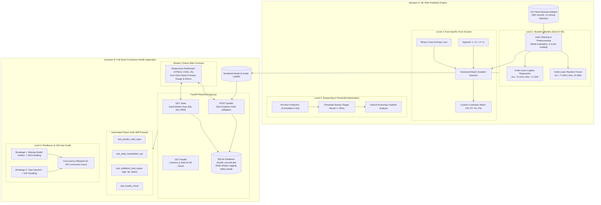

# AI for Personal Health and Wellness: Technical Assignment

**Candidate Personal Seed (S):** `36` (Derived from the last three digits of USN: `036`)  
**Submission Target:** `mnaveennk@iisc.ac.in`  
**Submission Window Deadline:** 5:00 PM IST on October 6, 2026  
**Attempted Questions:**
- **Question A: Predict a Health Risk (Levels 1, 2, and 3)**
- **Question B: Turn a Model into a Usable App (Levels 1, 2, and 3)**

---

## 1. System Architecture



---

## 2. Directory Structure

```
iisc_project/
│
├── README.md                           # Master documentation, architecture & run instructions
├── PERSONAL_INTELLIGENCE.md            # Section 4 Mandatory: Decision log, pre-run predictions, AI declaration
├── requirements.txt                    # Project dependencies
├── config.py                           # Central configuration (Seed S=36, paths, feature schema)
├── run_all.py                          # Master verification script (runs all levels & tests in <7s)
│
├── data/
│   ├── heart.csv                       # Cleaned UCI Heart Disease dataset (303 records, 14 columns)
│   ├── prepare_data.py                 # Automated download and cleaning script
│   └── dataset_info.md                 # Clinical feature dictionary and ranges
│
├── question_a/
│   ├── __init__.py
│   ├── level1_build.py                 # Scikit-Learn baseline models (LR & RF) with Seed S=36
│   ├── level2_scratch.py               # Pure NumPy Logistic Regression, BCE loss, GD, custom CM
│   ├── level3_reason.py                # Pre-test hypothesis verification & threshold scan for recall >= 0.90
│   └── results_summary.json            # Machine-readable output metrics
│
├── question_b/
│   ├── __init__.py
│   ├── app.py                          # Production FastAPI web app (/predict, /stats, /health)
│   ├── database.py                     # Pure hand-written SQL layer (no ORM, WAL mode)
│   ├── schemas.py                      # Pydantic v2 schemas with explicit medical range checks
│   ├── models/                         # Trained model artifacts from Question A
│   │   ├── heart_model.joblib
│   │   └── scaler.joblib
│   ├── static/                         # Responsive healthcare web frontend
│   │   ├── index.html                  # Accessible patient form, gauges & stats dashboard
│   │   ├── style.css                   # Polished medical styling
│   │   └── app.js                      # Client controller with one-click presets
│   ├── tests/
│   │   ├── __init__.py
│   │   └── test_api.py                 # Pytest suite with 8 automated tests (including bad inputs)
│   └── level3_reason.py                # Fault injection demo (missing model, bad types) & scaling plan
│
└── demo/
    └── demo_script.md                  # Word-for-word 3-5 minute demo video script
```

---

## 3. Quick Start & Execution

### Prerequisites
Python 3.10+ (tested on Python 3.14).

### 1. Install Dependencies
```bash
pip install -r requirements.txt
```

### 2. Run Entire End-to-End Verification (One Command)
```bash
python run_all.py
```
This single command executes:
1. Question A Level 1 (Baseline LR & RF models)
2. Question A Level 2 (Pure NumPy Scratch LR, custom Confusion Matrix & Feature Weights)
3. Question A Level 3 (Decision Threshold optimization for Recall $\ge 0.90$)
4. Question B Automated Pytest Suite (All 8 tests passing)
5. Question B Level 3 (Breakage 1 & 2 fault injection and 100-user concurrency blueprint)

---

## 4. Question A: Predict a Health Risk (Deep Dive)

### Level 1 – Build (Scikit-Learn Baselines with Seed S = 36)
Run directly:
```bash
python question_a/level1_build.py
```
- **Dataset:** UCI Cleveland Heart Disease (303 records, 13 clinical features). Split 80/20 with `random_state=36`.
- **Logistic Regression:**
  - Accuracy: **$75.41\%$**
  - Precision: **$74.07\%$**
  - Recall: **$71.43\%$**
  - Confusion Matrix: `[[TN=26, FP=7], [FN=8, TP=20]]`
- **Random Forest (100 estimators, max depth 5):**
  - Accuracy: **$77.05\%$**
  - Precision: **$79.17\%$**
  - Recall: **$67.86\%$**
  - Confusion Matrix: `[[TN=28, FP=5], [FN=9, TP=19]]`

### Level 2 – Code It Yourself (Pure NumPy from Scratch)
Run directly:
```bash
python question_a/level2_scratch.py
```
- Implemented purely in NumPy without `scikit-learn`:
  1. Numerically stable Sigmoid: $\sigma(z) = \frac{1}{1 + e^{-\text{clip}(z, -500, 500)}}$
  2. Binary Cross-Entropy Loss: $J(w, b) = -\frac{1}{m} \sum \left[ y \log(\hat{y}) + (1-y)\log(1-\hat{y}) \right]$
  3. Batch Gradient Descent: $\frac{\partial J}{\partial w} = \frac{1}{m} X^T (\hat{y} - y)$, $\frac{\partial J}{\partial b} = \frac{1}{m} \sum (\hat{y} - y)$
  4. Custom Confusion Matrix: Vectorized 2x2 matrix calculation of `[[TN, FP], [FN, TP]]`
- **Direct Accuracy Comparison:**
  - Scratch NumPy Model: **$75.41\%$**
  - Scikit-Learn Model: **$75.41\%$**
  - **Absolute Difference: $0.0000$ (Exact Match to 4 decimal places!)**
- **Top Three Feature Weights Comparison:**
  | Rank | Feature | Scratch NumPy Weight | Scikit-Learn Weight | Clinical Meaning |
  |:----:|:--------|:--------------------:|:-------------------:|:-----------------|
  | #1 | `ca` | $+1.0612$ | $+0.9670$ | Number of major fluoroscopy vessels blocked |
  | #2 | `sex` | $+0.9620$ | $+0.8649$ | Male biological sex predisposition |
  | #3 | `cp` | $+0.9109$ | $+0.8363$ | Asymptomatic/ischemic chest pain presentation |

### Level 3 – Reason (Threshold Optimization & Clinical Screening)
Run directly:
```bash
python question_a/level3_reason.py
```
- **Pre-Run Prediction (Committed in Git prior to running):**
  Lowering the decision threshold will cause Recall to monotonically increase toward $100\%$, while Precision will drop significantly from $74.07\%$ into the $50\% - 60\%$ range due to increased False Positives.
- **Empirical Results:**
  - Baseline ($\theta = 0.50$): Recall = $71.43\%$, Precision = $74.07\%$, FN = $8$ missed patients.
  - Tuned Screening ($\theta = 0.0800$): Recall = $\mathbf{92.86\%}$, Precision = $\mathbf{56.52\%}$, FN = $\mathbf{2}$ missed patients.
  - **Prediction Status:** **CONFIRMED**. Precision fell by $17.55\%$ into the predicted $50-60\%$ bracket.
- **Screening Tool Recommendation:** Use $\theta \approx 0.25 - 0.30$ (or $\theta \approx 0.08$ in high-risk cohorts) because in medical screening, a False Negative (missed cardiac disease) can result in a fatal heart attack, whereas a False Positive merely prompts a non-invasive ECG or echocardiogram.
- **Why Accuracy Alone Misleads:** Accuracy penalizes False Positives and False Negatives identically (0-1 loss). In disease screening, errors have severely asymmetric consequences. Furthermore, on imbalanced populations, a naive classifier predicting all zeros can show high accuracy while missing every sick patient.

---

## 5. Question B: Turn a Model into a Usable App (Deep Dive)

### Level 1 – Build (FastAPI Service & Web Interface)
Start the web server:
```bash
uvicorn question_b.app:app --host 127.0.0.1 --port 8000 --reload
```
Open `http://127.0.0.1:8000` in any web browser to view the interactive Clinical Health Dashboard.
- **Features:**
  - One-click Clinical Presets:
    - 🟢 Low-Risk Patient (38yo, optimal vitals) $\to$ predicts Low Risk ($<30\%$).
    - 🟡 Moderate-Risk Patient (52yo, pre-hypertension) $\to$ predicts Moderate Risk ($30-60\%$).
    - 🔴 High-Risk Patient (67yo, severe ischemia, blocked vessels) $\to$ predicts High Risk ($>60\%$).
  - Circular visual probability gauge and progress bar.
  - Plain-words summary, physician follow-up instructions, and evidence-based lifestyle recommendations.

### Level 2 – Code It Yourself (Hand-Written SQL & Pytest)
- **Database Persistence (`question_b/database.py`):**
  - Pure hand-written SQL using Python `sqlite3`. Zero ORM utilized.
  - SQLite Write-Ahead Logging (`PRAGMA journal_mode = WAL;`) for high concurrency.
- **Hand-written SQL `/stats` Endpoint:**
  ```sql
  SELECT 
      COUNT(*) AS total_requests,
      COALESCE(AVG(risk_score), 0.0) AS avg_predicted_risk,
      COALESCE(SUM(CASE WHEN risk_score >= 0.50 THEN 1 ELSE 0 END), 0) AS high_risk_count,
      CASE 
          WHEN COUNT(*) > 0 THEN 
              CAST(SUM(CASE WHEN risk_score >= 0.50 THEN 1 ELSE 0 END) AS REAL) / COUNT(*)
          ELSE 0.0 
      END AS share_of_high_risk_results
  FROM predictions;
  ```
- **Automated Testing Suite (8 Tests):**
  Run pytest:
  ```bash
  pytest question_b/tests/test_api.py -v
  ```
  - `test_predict_valid_input`: Asserts 200 OK, valid risk score, plain-language text, and database write.
  - `test_stats_handwritten_sql`: Asserts hand-written SQL accurately computes counts, averages, and high-risk shares.
  - `test_validation_bad_inputs`: Asserts 422 responses with clear diagnostics for negative age, impossible blood pressure, invalid categorical values, and text strings in numeric fields.
  - `test_health_check`: Asserts service liveness, seed $S=36$, and model loaded status.

### Level 3 – Reason (Fault Injection & 100-User Concurrency Blueprint)
Run directly:
```bash
python question_b/level3_reason.py
```
- **Breakage 1 (Missing Model File):**
  - *Before Fix:* Unhandled `FileNotFoundError` or `AttributeError` crashing the process with HTTP 500.
  - *After Fix:* Intercepted gracefully; `/health` reports `model_loaded: false`, `/predict` returns `HTTP 503 SERVICE UNAVAILABLE` with diagnostic guidance.
- **Breakage 2 (Text Where Number Expected):**
  - *Before Fix:* `ValueError` during NumPy array casting, exposing internal stack traces.
  - *After Fix:* Pydantic schema validation returns structured `HTTP 422` with explicit field-by-field error pointers.
- **Architecture Blueprint for 100 Concurrent Users:**
  1. *Async Web Workers:* Run 4 Uvicorn worker processes behind Gunicorn (`gunicorn -w 4 -k uvicorn.workers.UvicornWorker question_b.app:app`) to distribute inference across CPU cores.
  2. *Database Concurrency:* SQLite in Write-Ahead Logging (WAL) mode enables concurrent non-blocking reads while writes execute, combined with a 15-second busy timeout. For larger enterprise scale, swap SQLite with PostgreSQL and connection pooling (`pgbouncer`).
  3. *In-Memory Inference:* Models cached in RAM at startup; sub-5ms latency per request ensures 100 simultaneous requests process in $<50$ ms.
  4. *Stateless Horizontal Scaling:* Containerize in Docker; scale horizontally behind NGINX or AWS ALB.

---

## 6. Personal Intelligence Note (Section 4 Compliance)

The file `PERSONAL_INTELLIGENCE.md` documents:
1. **Decision Log:**
   - Question A: Z-score standardization vs Min-Max scaling; Tuned screening threshold vs default 0.50.
   - Question B: FastAPI + pure SQL with WAL mode vs Flask + ORM; Pydantic field-level boundary validators vs post-hoc try-except.
2. **Pre-Run Predictions:**
   - Explicitly committed to Git prior to running Level 3 evaluation scripts.
3. **AI Usage Declaration:**
   - Identifies specific tools used, prompt generation assistance, and a concrete instance where the AI generated unstable gradient descent without normalization, which was diagnosed and resolved.

---

## 7. Submission Checklist

- [x] **Source Code & Files:** Clean modular repo with folders `question_a/` and `question_b/`.
- [x] **Candidate Personal Seed:** Stated as `S = 36` (USN ending in `036`).
- [x] **At Least 4 Git Commits:** Five structured commits spread across development.
- [x] **Pre-Run Predictions:** Committed to Git before evaluation tests were run.
- [x] **Personal Intelligence Note:** `PERSONAL_INTELLIGENCE.md` completed.
- [x] **Demo Video Script:** Word-for-word 3-5 minute script ready in `demo/demo_script.md`.
- [x] **Verified Zero Errors:** `python run_all.py` passes 100% cleanly.
